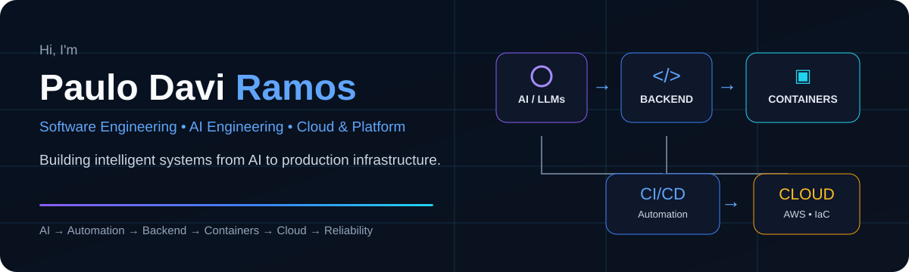

 

---

## ◈ Selected Work

<table>
<tr>
<td width="50%" valign="top">

### [FlowStock](https://github.com/DavidDevd/flowstock-public)
**Software / Product Engineering**

Full-stack SaaS project focused on engineering a real product beyond basic CRUD, connecting application architecture, APIs and product decisions.

`Backend` `APIs` `SaaS` `Product Engineering`

</td>
<td width="50%" valign="top">

### [AI Development Team](https://github.com/DavidDevd/ai-development-team)
**AI Engineering / Automation**

Modular AI-assisted engineering platform with separated responsibilities, delivery workflow, containerized services and automated quality validation.

`Python` `LLMs` `Docker` `GitHub Actions` `Tests`

</td>
</tr>
<tr>
<td width="50%" valign="top">

### [AWS CI/CD Pipeline](https://github.com/DavidDevd/devops.ci.api)
**DevOps / Cloud Delivery**

Automated test, Docker build, ECR publishing and AWS App Runner deployment workflow designed around repeatable software delivery.

`FastAPI` `Docker` `GitHub Actions` `AWS`

</td>
<td width="50%" valign="top">

### [FastAPI on Kubernetes](https://github.com/DavidDevd/desafio-kubernetes)
**Cloud Native / Reliability Foundations**

Containerized FastAPI and PostgreSQL deployment using Services, persistent storage, configuration, probes and autoscaling.

`Kubernetes` `FastAPI` `PostgreSQL` `HPA`

</td>
</tr>
</table>

> **Infrastructure evidence:** [Terraform Multi-Environment Infrastructure](https://github.com/DavidDevd/Configuracao-de-Infraestrutura-Multi-Ambiente) — versioned AWS infrastructure for dev, staging and production with VPC, EC2, ALB, Auto Scaling, S3 and DynamoDB.

---

## ◇ Engineering Focus

<table>
<tr>
<td width="25%" valign="top">

### 🧠 AI Engineering
LLM integrations  
AI agents  
RAG foundations  
API orchestration

</td>
<td width="25%" valign="top">

### ⚡ Automation
n8n workflows  
API integrations  
Process orchestration  
Intelligent workflows

</td>
<td width="25%" valign="top">

### `</>` Backend
Python / FastAPI  
REST APIs  
PostgreSQL  
Automated tests

</td>
<td width="25%" valign="top">

### ☁ Cloud & Platform
AWS / Docker  
Kubernetes  
Terraform / IaC  
CI/CD

</td>
</tr>
</table>

---

## ⎇ How I Build

**01 · IDEA**　→　**02 · DESIGN**　→　**03 · BUILD**　→　**04 · CONTAINERIZE**　→　**05 · DEPLOY**　→　**06 · OBSERVE**

`requirements` → `architecture` → `code + tests` → `Docker` → `CI/CD + cloud` → `health + metrics`

I connect application development with the infrastructure required to **test, deliver and operate software reliably** — from intelligent automation and APIs to containers, cloud deployment and operational readiness.

---

## ⛁ Core Stack

### AI & Automation

### Backend

### Cloud, Platform & Reliability

---

## ↗ Currently Building

**Engineering portfolio → AI-enabled software + cloud-native delivery + reliability foundations**

Current work is centered on strengthening project evidence through architecture documentation, automated delivery, observability and production-readiness rather than isolated technology demos.

---

## ◉ GitHub Activity

---

## Background

Analysis and Systems Development student currently working in **Technical Support N1**, developing practical experience with networking, connectivity diagnostics, infrastructure troubleshooting and user support.

I combine that operational foundation with software, AI automation and cloud projects while building toward **Software/AI Engineering, DevOps/Cloud and SRE-oriented roles**.

---

## Let's Connect

[**Portfolio**](https://daviddevd.github.io/pauloramos.github.io)　•　[**LinkedIn**](https://linkedin.com/in/paulo-ramos-b605a9209)　•　[**Email**](mailto:davifd642@gmail.com)

### From intelligence to infrastructure.
*I build, automate and operate modern systems.*

